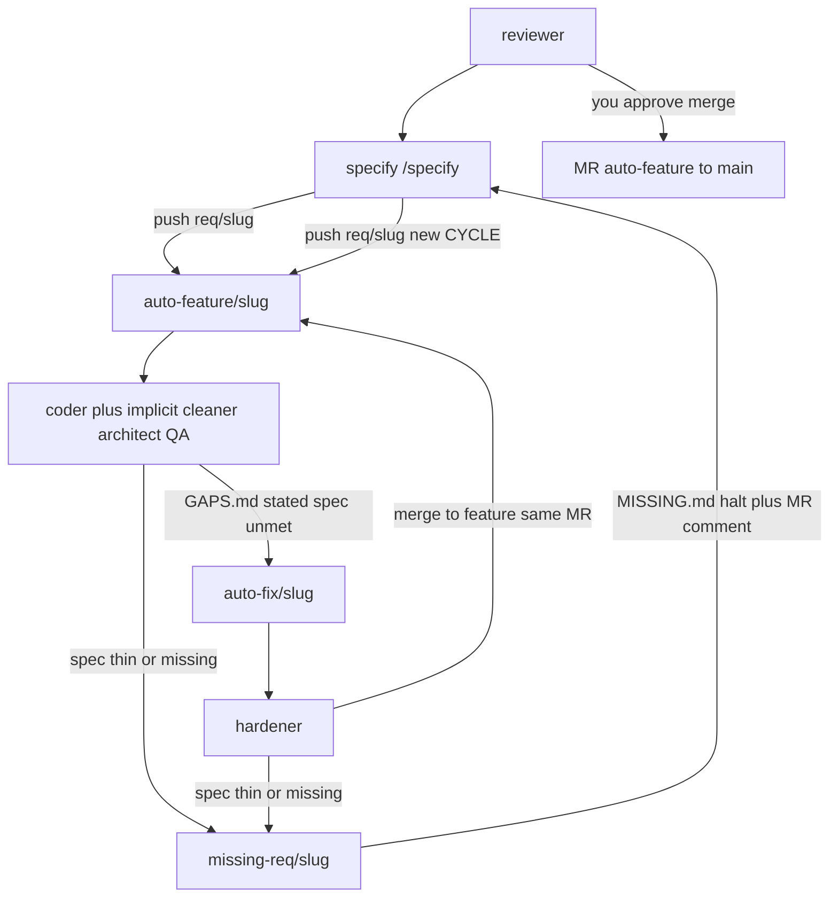

# lens-search

Personal product repo. `main` holds the product and merged RequirementSets. Agents do not commit on `main` or on `req/*`.

## Git layout

| Branch | Who | Role |
|---|---|---|
| `main` | you (merge click) | Product + spec after freeze |
| `req/<slug>` | you (`/specify`) | Human RequirementSet. Push opens auto-feature |
| `auto-feature/<slug>` | coder | One hashed cycle, one MR to `main` |
| `auto-fix/<slug>` | hardener | Child of the feature branch only. Merges back into the same MR |
| `missing-req/<slug>` | bot + you | Halt. `MISSING.md` only. Then you specify and push `req/<slug>` (new CYCLE) |

Push `req/<slug>` (when `missing-req/<slug>` is not open) creates `auto-feature/<slug>` from `main` plus `requirements/<slug>/`, writes `CYCLE` (hash of that tree), runs coder, and opens or updates **one** merge request `auto-feature/<slug>` → `main`. Bots never merge that MR. You freeze: approve and merge when GAPS is empty, missing-req is closed, and the tree hash still equals `CYCLE`.

`GAPS.md` means a stated specified test is not met (implementation hole). `MISSING.md` means the spec is too thin (specify again; do not invent Gherkin).



## Commands

- `/specify <feature-slug>` — write `requirements/<slug>/` on `req/<slug>` (or fill holes while `missing-req/<slug>` exists).

## Tests

```sh
./tests/run.sh
```
