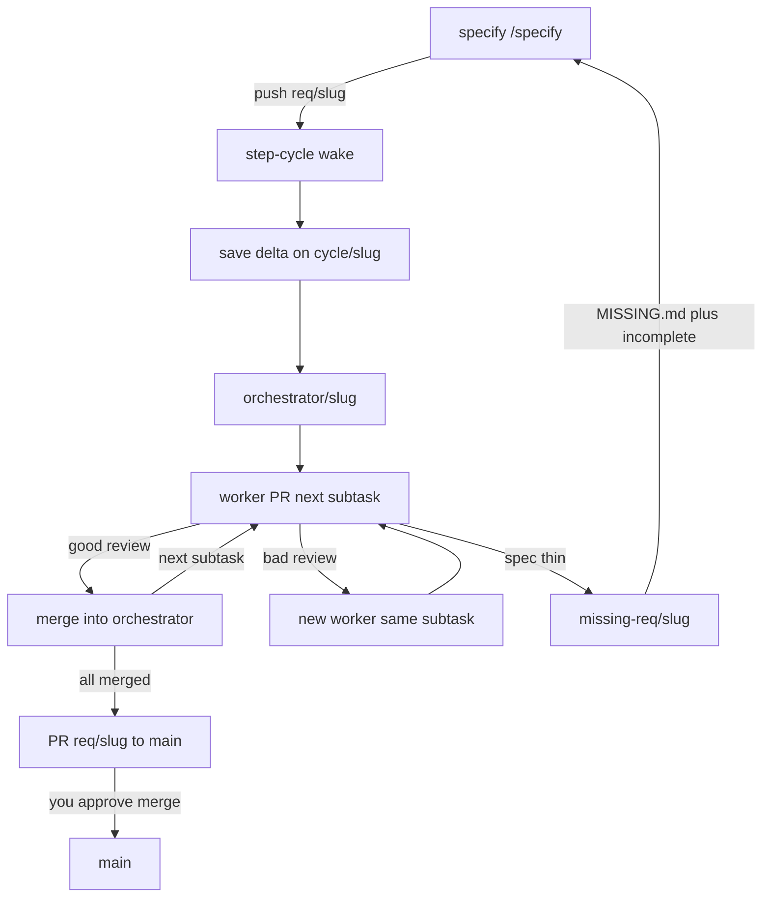

# lens-search

Personal product repo. `main` holds the product and merged RequirementSets. Agents do not commit on `main`. The cycle stepper may land the orchestrator onto `req/<slug>` when opening the requirement PR; humans still approve that merge.

## Git layout

| Branch | Who | Role |
|---|---|---|
| `main` | you (merge click) | Product + spec after freeze |
| `req/<slug>` | you (`/specify`) | Human RequirementSet. Push wakes the cycle |
| `cycle/<slug>` | stepper | `CYCLE.md` + saved delta. What the PO opens |
| `orchestrator/<slug>` | stepper | Integration branch; worker PRs merge here |
| `worker/<slug>/<n>-<k>` | worker | One subtask attempt, PR → orchestrator |
| `missing-req/<slug>` | bot + you | Halt. `MISSING.md` only. Then specify and push `req/<slug>` again |

Push `req/<slug>` wakes `step-cycle.sh`: save delta vs `main`, open the orchestrator and split subtasks, then one worker PR at a time. Review merges or respawns the same subtask. When every subtask has merged, a requirement → `main` PR opens. Bots never merge that PR. You freeze: approve and merge when the record shows all subtasks merged, incomplete is empty, and the tree hash still matches.

`CYCLE.md` is the cycle. `GAPS.md` on a worker is a bad review (respawn). `MISSING.md` means the spec is too thin (specify again; do not invent Gherkin).



## Commands

- `/specify <feature-slug>` — write `requirements/<slug>/` on `req/<slug>` (or fill holes while `missing-req/<slug>` exists).

## Tests

```sh
./tests/run.sh
```
